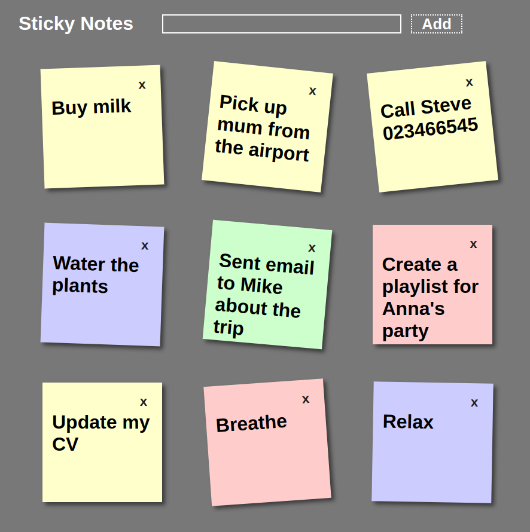

  
  <h1>Sticky Notes</h1>
  
  <h3>A web application allowing you to fill your screen with sticky notes of various colors</h3>

  <a href="https://sticky-notesjs.netlify.app/"><h3>Try me!</h3></a>

  

  
  

## Technologies Used

&nbsp;&nbsp;&nbsp;&nbsp;&nbsp;&nbsp;

&nbsp;&nbsp;&nbsp;&nbsp;&nbsp;&nbsp;

## Description

This is one of my first projects (and it shows). Notes are stored in an array as objects, and then rendered from there.

Data is not saved in local storage.

## License

Copyright (c) 2022 Michael Kolesidis 
Licensed under the [GNU General Public License v3.0](https://www.gnu.org/licenses/gpl-3.0.html).

 
 

[//]: # (Free Software)

   
   

  

                                                       

  

